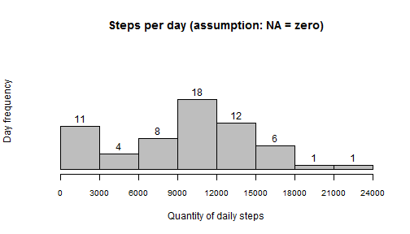
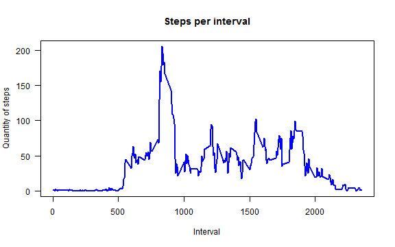
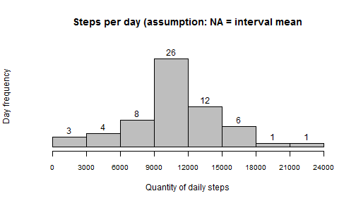
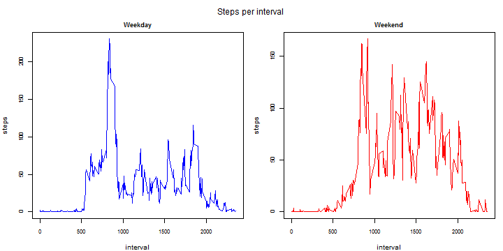
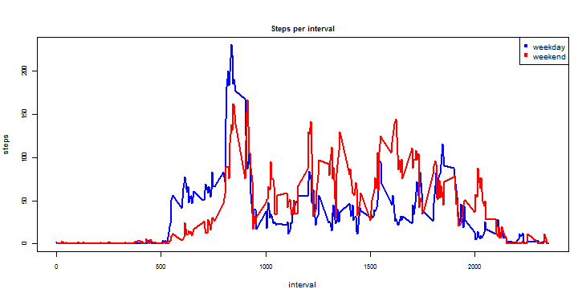

# REPRODUCIBLE RESEARCH - ASSIGNMENT 1

## Initial settings:
Loads necessary packages:

```r
library(graphics)
library(ggplot2)
library(knitr)
```

## Loading and preprocessing the data
### a) Loading data
Steps:  
1. Define local folder and file name  
2. Load the data in a variable called "myData"  
3. Remove auxiliary variables  
4. Creates a "filter vector" that indicates where are the values "NA"


```r
cDataDirectory = "./Data"
cFileName <- "activity.csv"
myData <- read.table (file = paste(cDataDirectory, cFileName, sep = "/"),
                      header = TRUE,
                      sep = ",")
rm(cDataDirectory, cFileName)
FilterNA <- !is.na(myData$steps)          
```

### b) Understanding NA values
Objetive: Do days with at least 1 interval with "NA" have all intervals with "NA"?  
Method: the vector "DayWithNAsteps" is assigned with the count of "NA" for each day (DayWithNAsteps[i]) with at least 1 "NA". The days without any "NA" are ignored in this analysis.  

For each day, the possible situations are:
* Count = 288 (24 hours * 12 intervals per hour): all intervals have "NA" values
* Count < 288: some intervals have "NA" and others have non "NA"

The variable "AllNAinFullNADays" tests if every day has 'count = 288'.   


```r
DayWithNAstepsAux1 <- xtabs(is.na(steps) ~ interval + date,
                 data = myData)     
DayWithNAstepsAux2 <- colSums(DayWithNAstepsAux1)
DayWithNAsteps <- DayWithNAstepsAux2[DayWithNAstepsAux2>0]
AllNAinFullNADays <- mean(DayWithNAsteps == (24*12)) ==1
rm(DayWithNAstepsAux1, DayWithNAstepsAux2, DayWithNAsteps)

print(AllNAinFullNADays)
```

```
## [1] TRUE
```

**Conclusion:** there are no "mixed" days (either the days have all values or none)

## What is mean total number of steps taken per day
In this exercise, the "NA" values were considered equal to ZERO.  

### a) Calculation of total number of steps taken each day
The vector "DailySum1" has 61 elements (1 for each day, including "NA days"), with the total number of steps per day


```r
DailySum1 <- xtabs(steps ~ date,
                   data = myData)
head(DailySum1)
```

```
## date
## 2012-10-01 2012-10-02 2012-10-03 2012-10-04 2012-10-05 2012-10-06 
##          0        126      11352      12116      13294      15420
```

### b) Histogram

```r
hist(x = DailySum1, 
     main = "Steps per day (assumption: NA = zero)", 
     breaks = c(0, 3000, 6000, 9000, 12000, 15000, 18000, 21000, 24000), 
     xlab = "Quantity of daily steps", 
     xlim = c(0, 24000), 
     xaxp = c(0, 24000, 8), 
     cex.axis = 0.8, 
     ylab = "Day frequency", 
     ylim = c(0,30), 
     yaxt = "n", 
     labels = TRUE, 
     col = "gray")
```



### c) Mean and median of total number of steps per day

```r
MeanDailySteps1 <- formatC(mean(DailySum1), format = "d")
MedianDailySteps1 <- formatC(quantile(x = DailySum1, probs = 0.5), format = "d")
```

**Mean:** 9354  
**Median:** 10395


## What is the average daily activity pattern?
### a) Calculation of mean number of steps per interval
The vector "IntervalMean1" has 288 elements (1 for each 5 min during the day), with the average number of steps per interval (to calculate this average, only the "non NA" days were considered)


```r
IntervalSum1 <- xtabs(steps ~ interval, 
                     data = myData)
NValidDates <- length(DailySum1[DailySum1>0])   #interval mean only within non NA values
IntervalMean1 <- IntervalSum1 / NValidDates
```

### b) Time series plot

```r
plot(x = names(IntervalMean1),
     y = as.numeric(IntervalMean1), 
     type = "l", 
     main = "Steps per interval", 
     xlab = "Interval",
     ylab = "Quantity of steps", 
     las = 1, 
     col = "blue", 
     lwd = 2)
```



### c) 5-minute interval that, on average, contains the maximum number of steps

```r
MaxIntervalSteps <- names(IntervalMean1[IntervalMean1 == max(IntervalMean1)])
MaxSteps <- formatC(x = max(IntervalMean1), format = "d")
```

**5-min interval with maximum number of steps:** interval 835, with 206 steps


## Inputing missing values
### a) Calculate and report the total number of missing values in the dataset

```r
CountNA <- sum(is.na(myData$steps))
```
**Total missing values:** 2304

### b) Devise a strategy for filling in all of the missing values in the dataset...  

Strategy: mean for that 5-minute interval

### c) Create a new dataset that is equal to the original dataset but with the missing data filled in.

The vector "StepsWithoutNA" is assigned with:
* The original data if != NA
* The interval mean if = NA (key: interval name)

The data.frame "myNewData" is assigned with the missing data filled in


```r
StepsWithoutNA <- vector(mode = "numeric", length = nrow(myData))
StepsWithoutNA[FilterNA] <- myData$steps[FilterNA]
StepsWithoutNA[!FilterNA] <- IntervalMean1[as.character(myData$interval[!FilterNA])]

myNewData <- myData
myNewData$steps <- StepsWithoutNA
```

### d) Make a histogram and calculate the mean and median total...

#### Calculation of total number of steps taken each day
The vector "DailySum2" has 61 elements (1 for each day, including "NA days"), with the total number of steps per day


```r
DailySum2 <- xtabs(steps ~ date,
                   data = myNewData)     
```

#### Histogram

```r
hist(x = DailySum2, 
     main = "Steps per day (assumption: NA = interval mean", 
     breaks = c(0, 3000, 6000, 9000, 12000, 15000, 18000, 21000, 24000), 
     xlab = "Quantity of daily steps", 
     xlim = c(0, 24000), 
     xaxp = c(0, 24000, 8), 
     cex.axis = 0.8, 
     ylab = "Day frequency", 
     ylim = c(0,30), 
     yaxt = "n", 
     labels = TRUE, 
     col = "gray")
```



#### Calculate and report the mean and median

```r
MeanDailySteps2 <- formatC(mean(DailySum2), format = "d")
MedianDailySteps2 <- formatC(median(x = DailySum2), format = "d")
```

* Mean without "NA": 10766  
* Median without "NA": 10766

#### Do these values differ from the estimates from the first part of the assignment
Yes!

#### ? What is the impact of imputing missing data on the estimates of the total daily number of steps?
Both values were increased, since the total number of steps has been increased (the "NA" values were considered equal to zero in the first exercise and now they are equal to the mean)

## Are there differences in activity patterns between weekdays and weekends?
### Create a new factor variable in the dataset with two levels - "weekday" and "weekend"...

Vector "Weekday" is assigned with the weekday (in Portuguese, my operational system).  
Vector "DayType" is assigned with the 2 levels factor.  


```r
WeekDay <- weekdays(as.Date(myNewData$date), abbreviate = TRUE)
DayType <- vector(mode = "character", length = length(WeekDay))
DayType[WeekDay %in% c("dom", "sáb")] <- "Weekend"
DayType[WeekDay %in% c("seg", "ter", "qua", "qui", "sex")] <- "Weekday"
table(DayType)
```

```
## DayType
## Weekday Weekend 
##   12960    4608
```

### Make a panel plot containing a time series plot...

#### Data for the plots
* "panelPlot" is a dataframe with 1 column for weekdays and 1 column for weekends  
* "dataPlot" is a dataframe with 1 column for the daytype (weekend or weekday)


```r
myNewData <- cbind(myNewData, DayType)
FiltroWDay <- DayType == "Weekday"
IntervalSumWDay <- xtabs(steps ~ interval, 
                      data = myNewData, 
                      subset = FiltroWDay)
NValidDatesWDay <- length(IntervalSumWDay[FiltroWDay==TRUE]) / (24*12)
IntervalMeanWDay <- IntervalSumWDay / NValidDatesWDay

IntervalSumWEnd <- xtabs(steps ~ interval, 
                         data = myNewData, 
                         subset = !FiltroWDay)
NValidDatesWEnd <- length(IntervalSumWDay[FiltroWDay==FALSE]) / (24*12)
IntervalMeanWEnd <- IntervalSumWEnd / NValidDatesWEnd

PanelPlot <- data.frame(interval = as.numeric(names(IntervalMeanWDay)), 
                       Weekday = as.numeric(IntervalMeanWDay),
                       Weekend = as.numeric(IntervalMeanWEnd))

dataPlot1 <- data.frame(interval = as.numeric(names(IntervalMeanWDay)), daytype = "weekday", steps = as.numeric(IntervalMeanWDay))
dataPlot2 <- data.frame(interval = as.numeric(names(IntervalMeanWEnd)), daytype = "weekend", steps = as.numeric(IntervalMeanWEnd))
dataPlot <- rbind(dataPlot1, dataPlot2)
```


#### Planel plot


```r
par(mfrow = c(1,2), mar = c(4, 4, 2, 1), oma = c(0, 0, 2, 0), cex = 0.8, cex.axis = 0.8)
with(PanelPlot, {
      plot(interval, Weekday, main = "Weekday", type = "l", ylab = "steps", cex.main = 0.9, col = "blue")
      plot(interval, Weekend, main = "Weekend", type = "l", ylab = "steps", cex.main = 0.9, col = "red")
      mtext("Steps per interval", outer = TRUE)
})
```



#### Unified plot

```r
par(mfrow = c(1,1), mar = c(4, 4, 2, 1), oma = c(0, 0, 2, 0), cex = 0.8, cex.axis = 0.8)
with(dataPlot, plot(interval, steps, 
                    main = "Steps per interval", cex.main = 0.9,
                    type = "n", 
                    ylab = "steps", xlab = "interval"))
with(subset(dataPlot, daytype == "weekday"), points(interval, steps, type = "l", lwd = 2, col = "blue"))
with(subset(dataPlot, daytype == "weekend"), points(interval, steps, type = "l", lwd = 2, col = "red"))
legend("topright", pch = 15, col = c("blue", "red"), legend = c("weekday", "weekend"))
```


